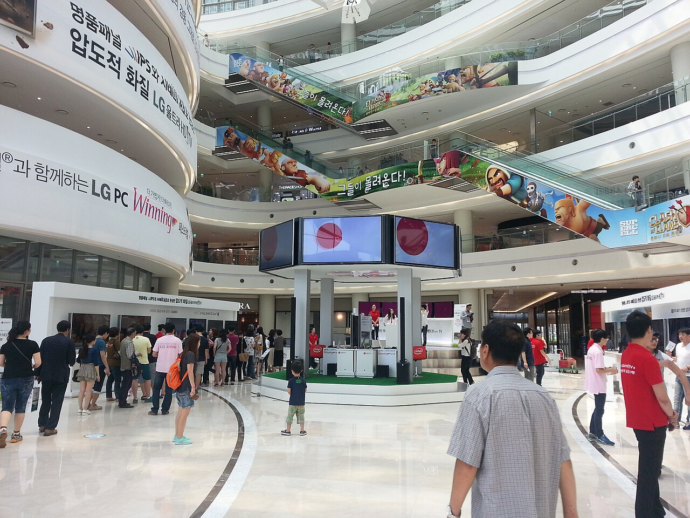
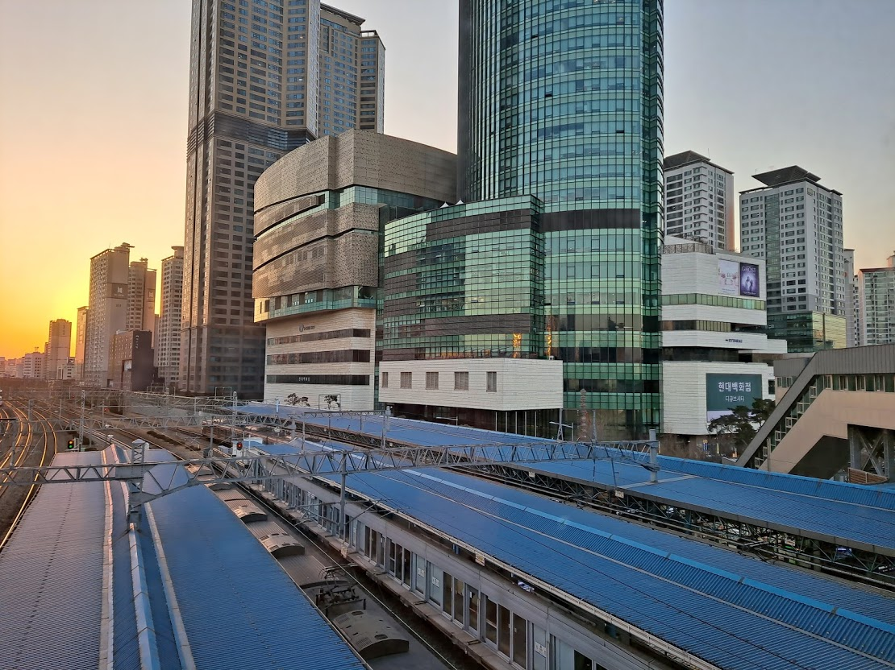
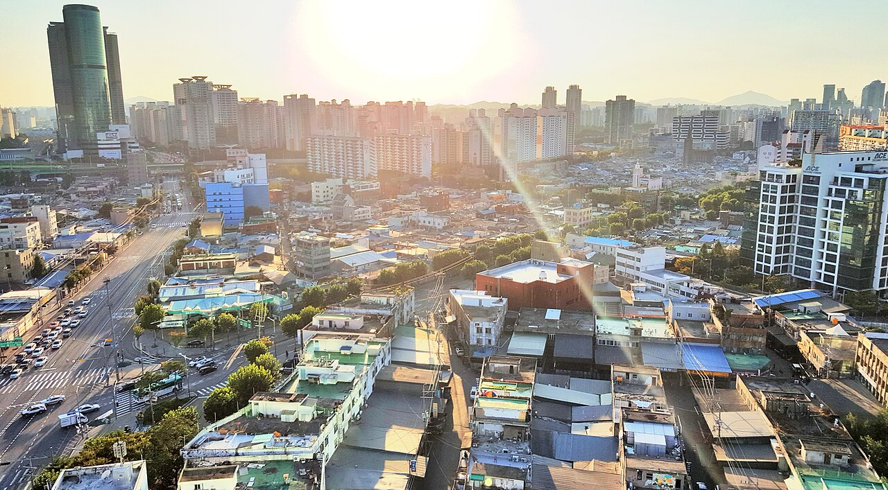
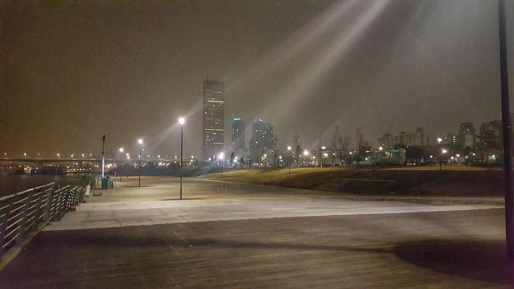
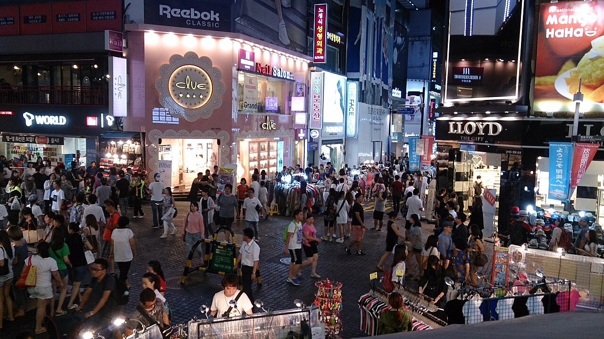
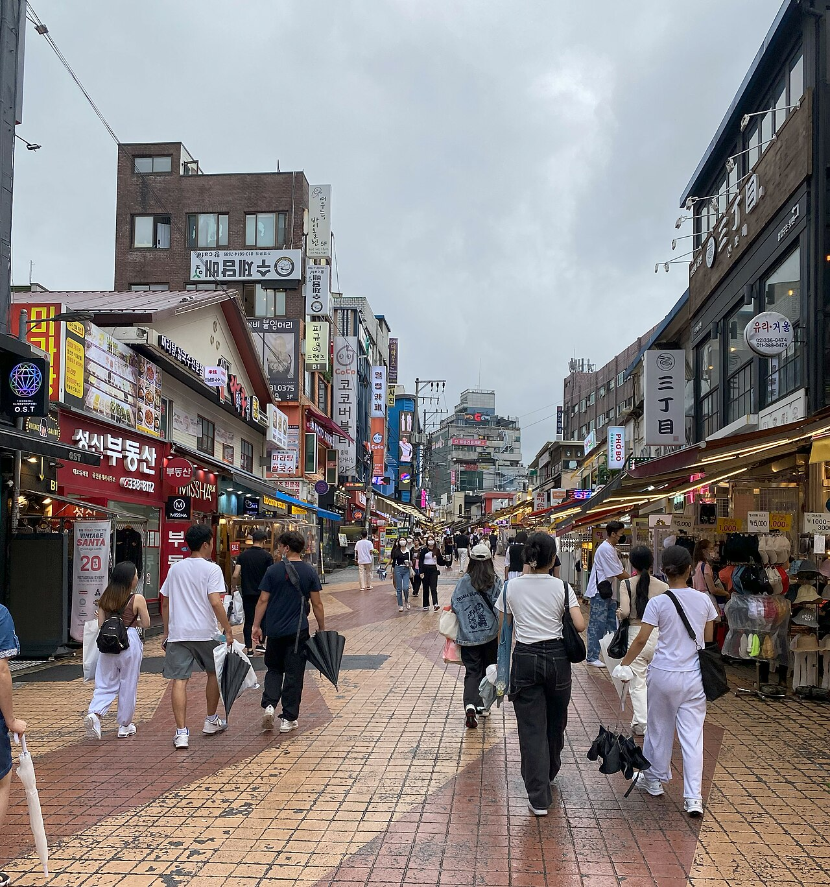

# 住宿周邊玩樂（Fairfield 永登浦 出發）

> 相關文件：[行程總覽](../行程.md)｜[飲食安排](../飲食.md)｜[事前準備](../事前準備.md)
>
> 用途：**不是正式行程**，是給「提早收工回飯店」或「休息一陣又想出門走走」時用的口袋清單。7 個地點全部從 **Fairfield by Marriott Seoul, Yeongdeungpo**（경인로 870, 영등포구 / 京畿仁路870，永登浦區）出發，依大眾運輸時間**由近到遠**排列，全部在 **40 分鐘以內**可達。每個地點都給了 Google Map QR code、交通方式、韓文店名／地名，方便語言不通時直接把手機轉給對方看。
>
> ⚠️ 交通時間為地鐵／公車估算值，實際請以 Naver Map／Kakao Map 現場路線為準。
>
> 📌 **任何一天★做完、人已回永登浦，才翻這頁。** 這裡不是拿來替代當天主鏈上的行程，是主鏈結束後多出來的時間才用的口袋清單。

---

## 01 · 영등포 타임스퀘어｜永登浦 Time Square
**步行約 8～10 分鐘 · 購物／電影／咖啡**

- **地址**：首爾永登浦區永中路15（15 Yeongjung-ro, Yeongdeungpo-gu）
- **交通**：飯店步行直達，不需搭車，晚餐後散步過去剛好
- **營業時間**：百貨約 10:30～22:00，電影院至深夜場
- **可以做什麼**：新世界百貨、教保文庫書店、CGV 影城、美食街、多間連鎖咖啡廳與酒吧。下雨天或懶得再出遠門時的萬用備案，逛街、喝咖啡、看場深夜電影都行。
- 📍 [Google Map QR](01_永登浦TimeSquare_購物/qr_location.jpg)｜[開啟 Google Map](https://maps.app.goo.gl/KZymsM3AHUK9U4P47)

---

## 02 · 영등포전통시장｜永登浦傳統市場
**步行約 10～12 分鐘 · 市場小吃／在地氣氛**

*（無圖片 — 找不到可靠授權的實景照片，QR code 仍可正常導航）*

- **地址**：首爾永登浦區永登浦洞一帶（Yeongdeungpo-dong, Yeongdeungpo-gu）
- **交通**：飯店步行即達，或搭一站地鐵至永登浦市場站（5號線）
- **營業時間**：多數攤位約 09:00～20:00，晚上收攤較早
- **可以做什麼**：傳統市場氛圍，生鮮、小吃攤、在地五金雜貨行混雜，適合吃完晚餐後散步消化，感受跟 Time Square 完全不同的「庶民永登浦」。不是觀光市場，晚上 8 點後多數攤位已收，想吃東西建議傍晚前去。
- 📍 [Google Map QR](02_永登浦傳統市場_市場小吃/qr_location.jpg)｜[開啟 Google Map](https://maps.app.goo.gl/a1fENKKY9YWPxsMt6)

---

## 03 · 디큐브시티（신도림）｜新道林 D-Cube City
**地鐵約 10～15 分鐘 · 購物／Outlet／親子**

- **地址**：首爾九老區京仁路662（662 Gyeongin-ro, Guro-gu）
- **交通**：地鐵1號線至新道林站（신도림역），約 2 站、5 分鐘車程，出站直通購物中心
- **營業時間**：約 10:30～22:00
- **可以做什麼**：現代百貨 Outlet＋大型商場，品牌折扣比市區百貨划算，另有美食街與超市，適合想順便補貨、買點藥妝或平價衣物的空檔。
- 📍 [Google Map QR](03_新道林DCubeCity_購物/qr_location.jpg)｜[開啟 Google Map](https://maps.app.goo.gl/f4rZ4S6V9i7vJVG28)

---

## 04 · 문래창작촌｜文來創作村（夜巷版）
**地鐵約 15～20 分鐘 · 咖啡／酒吧／藝術巷弄**

- **地址**：首爾永登浦區文來洞一帶（Mullae-dong, Yeongdeungpo-gu）
- **交通**：地鐵2號線至文來站（문래역），從永登浦搭公車或計程車約 10 分鐘可達站區，或步行至永登浦區廳站轉乘
- **營業時間**：巷弄全天開放，咖啡廳／酒吧多營業至深夜
- **可以做什麼**：與 10/30 白天走的路線不同，晚上的文來洞是鐵工廠鐵捲門拉下、壁畫燈光亮起、小酒吧陸續開門的另一種樣子。如果 10/30 沒走完或想再去，晚上單獨過來喝一杯氣氛完全不同。
- 📍 [Google Map QR](04_文來創作村夜巷_咖啡酒吧/qr_location.jpg)｜[開啟 Google Map](https://maps.app.goo.gl/VzH2wVtFAcNNexCh9)

---

## 05 · 여의도한강공원｜汝矣島漢江公園＋더현대서울
**地鐵約 20～25 分鐘 · 散步／夜景／百貨**

- **地址**：首爾永登浦區汝矣島洞一帶（Yeouido-dong, Yeongdeungpo-gu）
- **交通**：地鐵5號線至汝矣渡口站（여의나루역）或汝矣島站（여의도역），從永登浦區廳站轉乘約 2～3 站
- **營業時間**：公園全天開放；더현대서울百貨約 10:30～20:00（週五六至20:30）
- **可以做什麼**：漢江夜景＋63大廈燈光，河濱長椅坐著吹風最放鬆；더현대서울是首爾人氣最高的百貨之一，室內有大片綠植中庭，逛街兼躲雨都合適。晚上想安靜散步、白天想室內逛街都能來。
- 📍 [Google Map QR](05_汝矣島漢江公園_散步夜景/qr_location.jpg)｜[開啟 Google Map](https://maps.app.goo.gl/VoG4kiYWU9HEcnoDA)

---

## 06 · 명동거리｜明洞
**地鐵約 30～35 分鐘（1號線直達，不需轉乘）· 購物／街頭小吃**

- **地址**：首爾中區明洞一帶（Myeongdong, Jung-gu）
- **交通**：地鐵1號線直達明洞站（명동역），全程不需轉乘，約 33 分鐘
- **營業時間**：店家多營業至 22:00～23:00，街頭小吃攤晚上最熱鬧
- **可以做什麼**：美妝店、街頭小吃（辣炒年糕、雞蛋糕、起司龍蝦）、國際品牌旗艦店，觀光氣氛最濃厚的一區。1號線直達不用轉車是最大優點，晚上人潮邊走邊吃很方便，但假日較擁擠。
- 📍 [Google Map QR](06_明洞_購物美食/qr_location.jpg)｜[開啟 Google Map](https://maps.app.goo.gl/Pmb3vLQhisCnutkS7)

---

## 07 · 홍대 걷고싶은거리｜弘大（弘益大學商圈）
**地鐵約 30～35 分鐘（1號線轉2號線）· 購物／夜生活／live 表演**

- **地址**：首爾麻浦區西橋洞一帶（Seogyo-dong, Mapo-gu）
- **交通**：地鐵1號線至新道林站轉2號線，至弘大入口站（홍대입구역），約 30～35 分鐘
- **營業時間**：全天，夜生活商圈越晚越熱鬧（20:00 後最有氣氛）
- **可以做什麼**：年輕、有活力的大學商圈——服飾選物店、live 表演、路邊街頭藝人、深夜也熱鬧的酒吧與夜店一條街。距離最遠、車程也最接近 40 分鐘上限，建議只在還有體力、想感受「首爾夜生活」時安排，術後或走累的日子不要勉強跑這麼遠。
- 📍 [Google Map QR](07_弘大_購物夜生活/qr_location.jpg)｜[開啟 Google Map](https://maps.app.goo.gl/NsgY7aRi9EXVkK3LA)

---

## 使用建議

| 情境 | 建議去處 |
|---|---|
| 只想走 10 分鐘、吃點東西就回房 | 01 永登浦 Time Square、02 永登浦傳統市場 |
| 想順便買點東西、不想跑遠 | 03 新道林 D-Cube City |
| 晚餐後想喝一杯、感受在地氣氛 | 04 文來創作村（夜巷版） |
| 想看夜景、安靜散步 | 05 汝矣島漢江公園 |
| 還有力氣，想逛街＋吃街頭小吃 | 06 明洞 |
| 體力最好的一晚，想感受年輕夜生活 | 07 弘大 |

> 📌 11/2 醫美當天晚上請優先選 01、02、05（近、不費體力），06、07 車程接近 40 分鐘上限，術後不建議安排。
